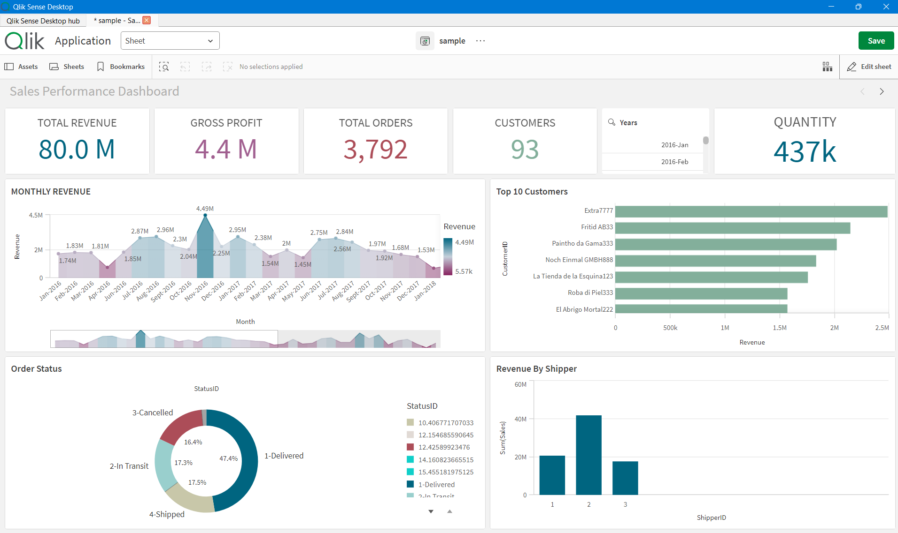
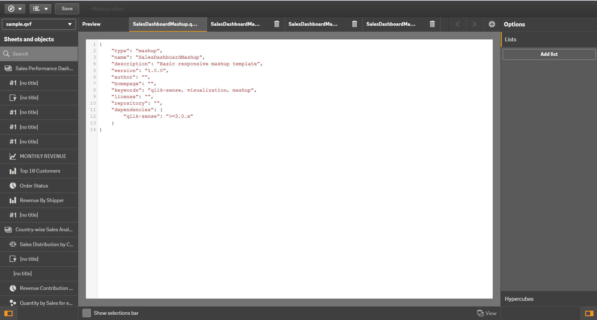
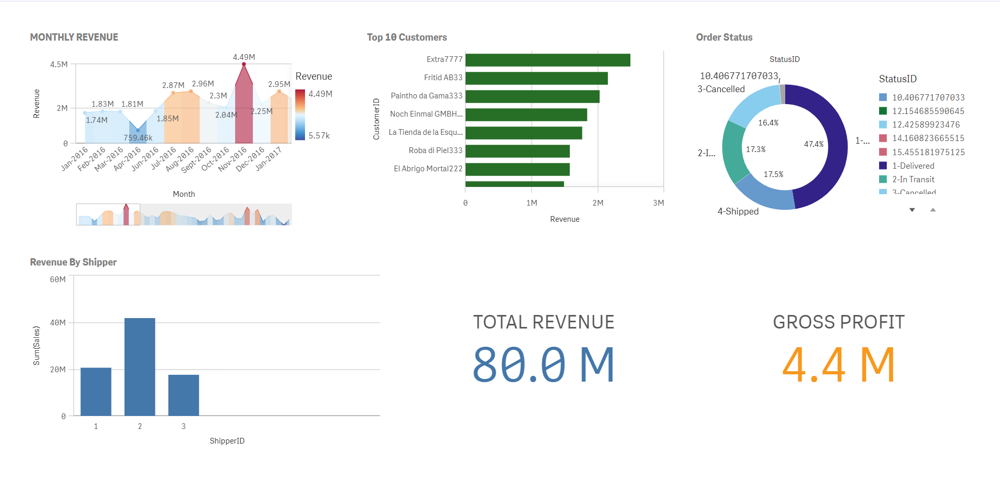

# Qlik Sense Mashup Project

## Project Overview

This project demonstrates the creation of a Qlik Sense Mashup using Qlik Sense Desktop Dev Hub.

A mashup allows Qlik Sense visualizations to be embedded into a custom web page using HTML, CSS, and JavaScript. The mashup was created by importing a Qlik Sense application into Qlik Sense Desktop and generating the mashup using the Dev Hub Mashup Editor.

---

## Objectives

* Learn the fundamentals of Qlik Sense Mashups
* Understand Qlik Sense Dev Hub
* Embed Qlik visualizations into a custom web page
* Understand the generated HTML, CSS, and JavaScript code
* Manage project files using Git and GitHub

---

## Application Details

| Property          | Value                              |
| ----------------- | ---------------------------------- |
| Application Name  | sample.qvf                         |
| Platform          | Qlik Sense Desktop                 |
| Development Tool  | Dev Hub                            |
| Technologies Used | HTML, CSS, JavaScript, Git, GitHub |

---

## Embedded Visualizations

| Visualization      | Type       | Object ID |
| ------------------ | ---------- | --------- |
| Monthly Revenue    | Area Chart | xPgB      |
| Top 10 Customers   | Bar Chart  | drqUyTT   |
| Order Status       | Pie Chart  | ghELmFE   |
| Revenue By Shipper | Bar Chart  | mZhh      |
| Total Revenue      | KPI        | mTmQk     |
| Gross Profit       | KPI        | eAdQnH    |

---

## Project Structure

```text
SalesDashboardMashup/
│
├── screenshots/
│   ├── Dashboard.png
│   ├── devhub-editor.png
│   └── mashup-preview.png
│
├── SalesDashboardMashup.html
├── SalesDashboardMashup.js
├── SalesDashboardMashup.css
├── SalesDashboardMashup.qext
├── wbfolder.wbl
└── README.md
```

---

## Development Workflow

1. Created a sales dashboard in Qlik Sense.
2. Imported the application into Qlik Sense Desktop.
3. Opened Dev Hub and created a new mashup project.
4. Selected the application and embedded visualizations.
5. Generated mashup HTML, CSS, and JavaScript files.
6. Managed source code using Git and GitHub.

---

## Mashup Architecture

```text
Qlik Sense Application
          │
          ▼
     Qlik Objects
          │
          ▼
    app.getObject()
          │
          ▼
    HTML Containers
          │
          ▼
 Embedded Visualizations
```

---

## Key Implementation

The mashup uses the Qlik Capability API to retrieve visualizations from the application and render them inside HTML containers.

Example:

```javascript
var app = qlik.openApp('sample.qvf', config);

app.getObject('QV01', 'xPgB');
app.getObject('QV02', 'drqUyTT');
app.getObject('QV03', 'ghELmFE');
```

Each visualization is loaded using:

```javascript
app.getObject(containerId, objectId);
```

Where:

* `containerId` is the HTML element ID.
* `objectId` is the Qlik visualization object ID.

---

## Technologies Used

* Qlik Sense Desktop
* Qlik Dev Hub
* HTML5
* CSS3
* JavaScript
* Git
* GitHub

---

## Screenshots

### Original Dashboard

The original Qlik Sense dashboard containing KPIs, charts, and filters.



### Dev Hub Mashup Editor

Mashup created in Qlik Dev Hub by selecting application objects and arranging them in a custom layout.



### Mashup Preview

Final mashup displaying embedded Qlik Sense visualizations and KPI objects.



---

## Learning Outcomes

Through this project, I learned:

* Qlik Sense Mashup architecture
* Working with Qlik Dev Hub
* Embedding Qlik visualizations into web pages
* Understanding generated mashup files
* Using the Qlik Capability API
* Managing source code with Git and GitHub
* Importing Qlik applications into Qlik Sense Desktop

---

## Future Enhancements

* Responsive dashboard layout
* Additional KPI visualizations
* Advanced filtering and selections
* Custom styling and branding
* Deployment to a web server
* Integration with Qlik Sense Cloud

---

## Author

Priyanshi Varshney

Intern Project – Qlik Sense Mashup Development
